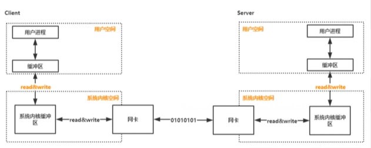

- Redis性能有哪些因素决定
	- 内存
	  数据类型比较高效
	- CPU
	  IO层面是单线程有多线程场景（比如异步任务数据复制）
	- 网络通信
		- 只要是网络通信 ip+port的连接服务，要么NIO原生要么基于netty
			- zookeeper基于原生NIO
			- dubbo基于netty 
			  tcp/udp说的是每一次连接
- 10w tps 意味着客户端连接有10连接w个请求
- 网络通信模型：
	- BIO（阻塞IO模型） socket  -->  serverSocket
		- 演示BIO，自己写一个代码reids-network-model/BIOServerSocket，然后telent ip:port,阻塞的serversocket.accept()就会结束，并且telnet连接后你发一个hello在BIOServerSocket会打印出hello
			- 更进一步演示（IO阻塞）：启动两个telnet会变成一个串行请求，一个telnet（第二个窗口先来）发送aaa 一个telnet发送bbb发现被阻塞（因为被阻塞在第一个窗口上）
				- 把IO部分放到线程池里面 
				- 使用场景：
					- zookeeper的leader选举
					- nacos的注册地址信息同步
	- NIO
	  最开始叫New IO，提供了Channel Buffer Seletor提供了非阻塞功能
		- （连接非阻塞IO阻塞）演示NIOServerSocket，即便没有连接过来 也打印了System.out.println("我是非阻塞")
		  意思是没有阻塞在serverSocketChannel.accept()方法。
			- 加上 socketChannel.configureBlocking(false); IO也是非阻塞了
			-
- 多态设备间通信流程：
	- {:height 242, :width 586}
	  为什么划分内核和用户空间是为了安全性考虑，用户应用程序不能操作内核空间
-